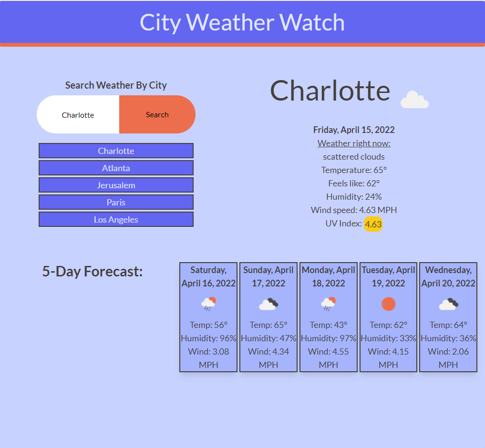

# City-Weather-Watch

## About
Check the weather for any city

The webpage includes:
- Search any city
- Search history feature saves 5 most recent searched cities
- Current weather report with UV Index that is color coded for skin safety
- 5-day forecast that includes average temperature for the day, humidity, and wind speed

UV Index reference used is from [Animas Surgical Hospital](https://www.animassurgical.com/the-uv-index-and-why-you-should-care-about-it/)

## API
[OpenWeather One Call API 1.0](https://openweathermap.org/api/one-call-api) was used to provide weather data for the site

## Webpage
Link: [live webpage](https://jameshardin02.github.io/City-Weather-Watch/).

